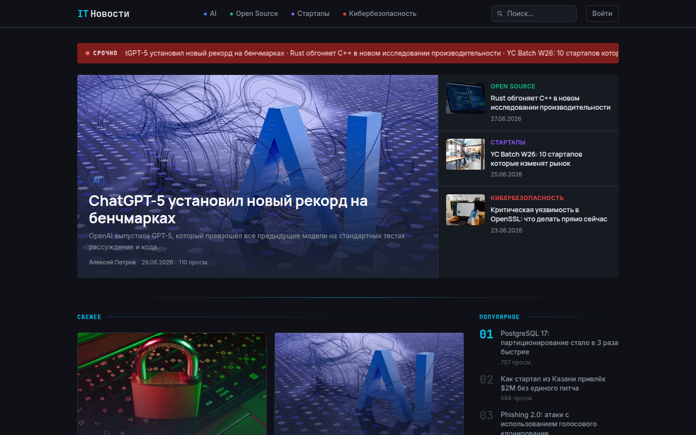

# 📰 News Portal — новостной портал под ключ: SSR, поиск, комментарии и своя админка

Полнофункциональный медиа-сайт на Next.js + FastAPI: публикация новостей, поиск, комментарии с реакциями и админ-панель для редакции. Не шаблон и не конструктор — рабочая связка "сайт + CMS", которую можно взять за основу для реального проекта.

## 🧩 Что это

Новостной портал, где редакция публикует статьи по категориям и авторам, а посетители читают их, ищут по сайту, комментируют и оценивают комментарии лайком/дизлайком. Публичная часть отдаётся через SSR для быстрой индексации в поиске, редакционная часть работает как SPA поверх того же API.

## 🎯 Какую проблему решает

Задача — дать медиа-проекту или корпоративному блогу готовую связку "сайт + CMS" без подписки на внешние SaaS-платформы (Tilda, WordPress-хостинг и т.п.): собственная база данных, собственная админка для журналистов, SEO из коробки за счёт серверного рендеринга и sitemap/RSS, при этом инфраструктура полностью под контролем владельца (Docker, свой сервер, свой домен).

## ⚙️ Ключевые возможности

- Лента статей с пагинацией, фильтром по категории/автору и сортировкой по просмотрам
- Страница статьи со счётчиком просмотров, похожими материалами и комментариями
- Полнотекстовый поиск по статьям (debounce на фронте, ILIKE-поиск по заголовку и контенту на бэке)
- Комментарии с модерацией (публикация только после одобрения администратором)
- Реакции на комментарии (лайк/дизлайк) для зарегистрированных пользователей
- Регистрация и вход пользователей по email/паролю, а также вход через Telegram
- RSS-лента (`/rss.xml`) и данные для sitemap, генерируемые бэкендом
- SEO: `generateMetadata` и Open Graph на каждой странице
- Админ-панель (JWT-авторизация): CRUD статей с WYSIWYG-редактором и загрузкой обложек, CRUD категорий и авторов, модерация комментариев, раздел статистики
- Категории, авторы и теги как отдельные сущности со своими страницами

## 🛠 Как реализовано

- **Backend:** FastAPI (async) + SQLAlchemy 2.0 (asyncio) + PostgreSQL, asyncpg-драйвер, JWT (python-jose) и bcrypt-хеширование паролей, загрузка файлов через aiofiles
- **Frontend:** Next.js 14 (App Router), SSR для публичных страниц и CSR для админки, TipTap как rich-text редактор статей, Tailwind CSS
- **Инфраструктура:** Docker Compose (отдельные контейнеры frontend/backend), nginx как реверс-прокси с SSL через certbot, volume для загруженных обложек
- Разделение сетевого доступа: сервис бэкенда подключён и к `shared_net` (для внешнего nginx), и к внутренней `internal`-сети, а фронтенд общается с бэкендом по внутреннему хосту `http://backend:8000`, тогда как клиентский JS ходит на публичный `https://news.swiftstream.ru`
- Отдельные модели `Admin` (редакция) и `SiteUser` (читатели) с разными правами: первые управляют контентом, вторые оставляют комментарии и реакции

## ✅ В чём плюсы

- SSR/SEO сделаны не для галочки: `generateMetadata` и OG-теги на каждом типе страницы, серверный sitemap и RSS отдаются с бэкенда, а не заглушкой
- Чёткое разделение прав: JWT для редакции и отдельная авторизация для читателей (email/пароль + Telegram-логин) вместо одной общей роли "пользователь"
- Реакции на комментарии реализованы через отдельную таблицу `CommentReaction` с уникальностью по паре (комментарий, пользователь) — повторный лайк обновляет значение, а не плодит дубли
- Правильная сетевая изоляция в Docker Compose: бэкенд смотрит наружу через общую сеть nginx, а фронтенд обращается к нему по приватному внутреннему адресу
- Модерация комментариев не косметическая: комментарий не появляется на сайте, пока администратор не одобрит его через `PUT /api/admin/comments/:id`

## 🚀 Демо

https://news.swiftstream.ru

---

*Демо-проект для портфолио*
